Typical Heap Vulnerability in Windows System
-
Dịch từ bài báo: [Research on Generation Principle and Utilization Method of Typical Heap Vulnerability in Windows System](https://www.jianshu.com/p/a853040d2804)

Lưu ý bài dịch có thể không chính xác với nội dung mà tác giả truyền tải, làm ơn góp ý cho tôi nếu bạn thấy điều đó.

# ABSTRACT
Với sự tiến bộ của thời đại ngày nay cùng với sự phát triển khoa học và kĩ thuật, hiệu suất của máy tính cũng ngày càng phát triển (nhanh hơn, mạnh hơn), nhu cầu của mọi người đối với máy tính cá nhân cũng dần thay đổi, họ bắt đầu cần sự an toàn hơn là hiệu suất hoạt động. Đặc biệt, trong những năm gần đây, việc thường xuyên để lộ lỗ hổng bộ nhớ máy tính cá nhân đã gây nguy hiểm nghiêm trọng đến sự cố bảo mật thông tin cá nhân của người dùng, điều đó đã thúc đẩy quá trình chuyển hóa tư tưởng. Là hệ điều hành chủ đạo của máy tính cá nhân, hệ điều hành Windows gánh trên vai trọng trách chịu trách nhiệm về thông tin cá nhân của người dùng. Từ đó, bảo mật của hệ điều hành Windows liên quan trực tiếp đến bảo mật thông tin cá nhân của hầu hết mọi người.

Quản lí bộ nhớ stack trên Windows đã được nghiên cứu một cách triệt để, nó hoạt động riêng lẻ nên rất khó để có lỗ hỏng mới. Ngược lại với stack, heap có cơ chế quản lí và phương thức hoạt động tương đối phức tạp hơn.

Bài báo này sẽ khám phá lịch sử phát triển, thuật toán cơ bản, nguyên tắc hoạt động của heap trên hệ điều hành Windows và tóm tắt việc triển khai cụ thể cơ chế quản lý heap của hệ điều hành Windows tại mỗi giai đoạn mà nó tạo ra các nguyên tắc và phương pháp sử dụng của các lỗ hỏng heap điển hình. Mục tiêu là để hiểu sâu về điều cơ bản của hệ điều hành Windows thông qua giới thiệu và tóm lược, từ đó và cung cấp một số sự trợ giúp cho những người đam mê bảo mật quan tâm nhiều đến heap trên hệ điều hành Windows.

## 1. Research background
Trong những năm gần đây, lỗ hỏng trên hệ điều hành chủ đạo của máy tính cá nhân - Windows - đã lần lượt xuất hiện, đe dọa đến an toàn thông tin của người dùng. Trong đó lỗ hỏng quan trọng buffer overflow được xem là một lỗ hỏng kỳ cựu (veteran). Vì tò mò về nguyên nhân gây ra lỗ hỏng, tác giá đã bắt đầu khám phá về Windows heap buffer. Trong bộ nhớ của Windows,  là nơi bí ẩn nhất, hấp dẫn trong số các nơi hấp dẫn. Đồng thời, heap cũng là nơi đầy hỗn loạn của bộ nhớ Windows. vì Microsoft đã không tiết lộ đầy đủ các chi tiết về quản lý heap trong hệ điều hành Windows, tất cả chỉ có thể dựa vào các công cụ gỡ lỗi như `OllyDbg`, `WinDbg` và từ các tài liệu, bài viết được viết bởi các người đi trước để tiến bộ từ từ.

Hệ điều hành Windows đã trải qua nhiều năm phát triển, đi cùng với sự phát triển đó, cơ chế quản lí heap của Windows cũng đã trải qua những thay đổi lớn. Cơ chế quản lí heap hiện tại có tính đến nhiều yêu tố khác nhau chẳng hạn như việc sử dụng hiệu quả bộ nhớ của hệ điều hành Windows và hiệu quả của việc ra quyết định trong việc cấp phát/phân bổ bộ nhớ, an toàn và mạnh mẽ. Chính việc tối ưu hóa hiệu suất đã khiến cơ chế quản lí heap trên Windows trở nên cực kỳ phức tạp. Bài báo này sẽ lấy cơ chế quản lý heap trên nền tảng Win32 làm đại diện cho việc nghiên cứu sự phát triển của cơ chế quản lý heap trên hệ điều hành Windows. Từ việc nghiên cứu đó, tác giả bài báo đã chia việc nghiên cứu thành 3 giai đoạn:
  1. Windows 2000 - Windows XP SP1: Tại thời điểm này, hệ thống quản lý heap tương đối sơ khai. Nó không chú trọng đến sự an toàn của bộ nhớ heap, mà chú trọng vào việc phân bổ và cải thiện hiệu suất. Đây là giai đoạn mà vấn đề bảo mật của heap trở nên nghiêm trọng và dễ bị tấn công hơn.
  2. Windows XP SP2 - Windows 2003: Từ kinh nghiệm của giai đoạn trước, giai đoạn này, Windows chia trình quản lý heap thành hai trình quản lý khác nhau: front-end và back-end. Đồng thời họ cũng đã thêm vào nhiều biện pháp bảo vệ an toàn, ví dụ như header format của heap block được thay đổi và thêm vào một cơ chế security verification, cụ thể là cơ chế Cookie. Khi một node trong danh sách liên kết đôi được xóa, hệ thống sẽ xác minh pointer của heap block, điều này sẽ gây khó khăn hơn trong việc tấn công heap, tuy nhiên kẻ tấn công vẫn có thể sử dụng các phương thức tấn công nâng cao để khai thác thành công heap overflow vào các phần mêm chưa các code không được chuẩn hóa của lập trình viên.
  3. Windows Vista - Windows 7: Sau một thời gian dài phát triển, cơ chế quản lý front-end của heap đã được cải cách, một cơ chế quản lý heap và cấu trúc heap block mới đã được giới thiệu. Đây là một bước nhảy vọt trong hiệu quả phân phối và bảo vệ an toàn.
  
  Phẩn dưới đây sẽ giải thích chi tiết về việc chuẩn bị môi trường, cấu trúc quan trọng, cơ chế phân bổ, cơ chế bảo vệ của heap trong cả ba giai đoạn trên. Từ đó đưa ra nguyên nhân và phương pháp sử dụng các lỗ hỏng phổ biến.
  
## Windows 2000 - Windows XP SP1

### 2.1 Environmental preparation
Máy ảo Windows 2000 SP4 32-bit, OllyDbg, WinDbg.

### 2.2 Important structure
Ở giai đoạn này, toàn bộ heap space chủ yêu duy trì ở 4 structure: segment list, virtual allocation list, free list and lookaside. Trong đó, hai cấu trúc dữ liệu khác được liên kết đến một bảng trống, tên là Freelist Bitmap và Heap Cache. Sự ra đời của hai cấu trúc dữ liệu này giúp tăng tốc quá trình cấp phát qua việc giảm số lần sử dụng empty table trong quá trình cấp phát.

#### 2.2.1 Basic structure of heap
Cấu trúc heap của trạng thái bận trong giai đoạn này được biểu diễn như hình bên dưới:

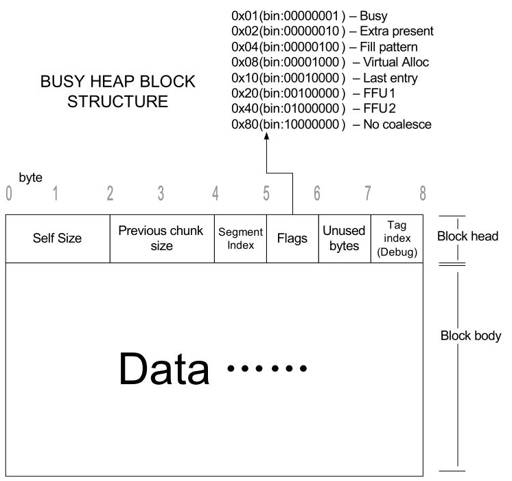

Ngược lại với hình trên, hình sau là cấu trúc heap ở trạng thái nhàn rỗi (free):


#### 2.2.2 Empty table
Trong quá trình cấp phát heap, chúng ta chủ yếu quan tâm đến các quy tắc phân bổ của empty tables và fast table, cái mà quản lý các heap block đã free. Tổng cộng có 128 danh sách liên kết đôi trong empty list. Mỗi danh sách liên kết đôi sẽ là một empty list. Trừ empty list NO. 0 và NO. 1, từ NO. 2 đến NO. 127 được duy trì từ 16 byte (bao gồm heap header) đến 1016 bytes (bao gồm heap header) với mỗi emply table sẽ tăng 8 bytes tức kích thước của mỗi heap block mà nó chứa sẽ là `empty table number * 8 bytes` (ví dụ NO. 10 sẽ chứa heap block có kích thước 10*8 = 80 bytes). Vì heap header ở trạng thái nhàn rỗi (free) luôn là 8 byte nên empty table NO. 1 sẽ không chứa bất kỳ heap block nào. Các Block nhập vào trong empty list sẽ tuân theo quy tắc first-in-last-out (FILO - vào trước thì ra sau). Empty table NO. 0 sẽ chứa các heap block có kích thước lớn hơn 1016 byte và nhỏ hơn 512 kbytes được sắp xếp theo thứ tự tăng dần kích thước. Dưới đây là hình ảnh mô tả empty table:

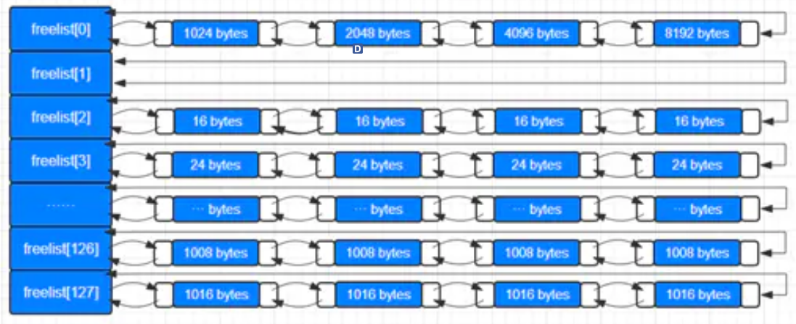

#### 2.2.3 Empty table bitmap
Kích thước của empty table bitmap là 128 bit, với mỗi bit tương ứng với một empty table tương ứng. Nếu không có bất kỳ free heap block nào trong empty table tương ứng, bit tương ứng trong empty table map sẽ là 0, ngược lại sẽ là 1. Sau khi cấp phát bộ nhớ từ empty table có kích thước tương ứng không thành công, hệ điều hành sẽ cố gắng tìm empty table gần nhất có kích thước đáp ứng kích thước cần cấp phát và có các free heap block từ empty table map. Điều này giúp tăng tốc độ của việc dùng empty table.

#### 2.2.4 Heap cache

Heap cache là một mảng chứa 896 pointers. Các con trỏ này là NULL để trỏ đến các free heap block có kích thước 1024-8192 bytes trong empty table NO. 0. Mỗi phần tử trong mảng tương ứng với một free heap block có kích thước `1024 bytes + 8 bytes * its index number` trong empty table NO. 0. Nếu có một free heap block trong empty table NO. 0 phù hơp với kích thước của nó, phần tử tương ứng trong mảng heap cache sẽ là một con trỏ trỏ đến free heap block đó, ngược lại phần tử tương ứng này sẽ là NULL. Phần tử cuối cùng là một phần tử đặc biệt, phần tử này không chỉ trỏ đến một free heap block có kích thước 8192 bytes (896*895) mà còn trỏ đến một free heap block có kích thước lơn hơn hoặc bằng 8192 bytes trong empty table NO. 0. Để tăng tốc độ truyên của heap cache, heap cache bitmap được giới thiệu để đánh dấu các con trỏ không phải NULL trong heap cache, có cơ chế tương tự như empty table bitmap. Sau khi sử dụng empty table bitmap để phân bổ bộ nhớ đến empty table khác 0, hệ thống sẽ cố gắn lấy index heap cache bitmap đến mảng heap cache để tìm free heap block trong empty table không đáp ứng kích thước phân bổ.

#### 2.2.5 Quick table
Fast table tương tự như Fastbin trong hệ thống Linux, nó là một cấu trúc dữ liệu tồn tại để đẩy nhanh việc phân phối các block nhỏ của hệ thỏ của hệ. Có 128 danh sách liên kết đơn trong quick table, mỗi danh sách liên kết đơn là một quick table. Trừ NO. 0 và NO. 1, các quick table từ NO. 2 đến NO. 127 sẽ duy trì từ 16 bytes (bao gồm cả header) đến 1016 bytes (bao gồm cả header) fast table với mỗi cái được tăng lên 8 bytes tức kích thước của mỗi fast table mà nó chứa sẽ là `fast table number * 8 bytes`. Vì heap header ở trạng thái nhàn rỗi (free) luôn là 8 byte nên fast table NO. 1 sẽ không chứa bất kỳ heap block nào. Mỗi fast table sẽ chứa tối đa 4 node, và cũng sẽ tuần thủ theo quy tắc FILO. Để cải thiện tốc độ phân bố của các heap block nhỏ, các free heap block trong fast table sẽ không được hợp lại. Cấu trúc của fast table được mô tả như hình dưới: 


### 2.3 Heap block operation
Trong memory, heap block được chia làm ba loại tùy thuộc vào kích thước của nó: small blocks (<1KB), large blocks (<512KB) và huge blocks (≥512KB). Chủ yếu có ba chế độ hoạt động cho các heap block: cấp phát heap block, giải phóng heap block, và hợp các heap block.

#### 2.3.1 Heap block allocation
Khi một heap block được cấp phát, nó chủ yếu được cấp phát từ fast table và empty table được đề cập ở trên.

Khi heap block được cấp phát từ fast table, trước tiên user sẽ đưa ra kích thước của heap block, dựa vào kích thước này, sẽ lấy ra chỉ mục (index) của fast table chứa kích thước tương ứng, free heap block cuối cùng được liên kết với bảng đó sẽ được lấy ra khỏi bảng và cấp phát cho user sử dụng. Header sẽ trỏ đến free heap block của item tiếp theo.

Khi thực hiện cấp phát heap block từ một empty table, một empty table có kích thước tương ứng sẽ được lấy ra đầu tiên, free heap block cuối cùng liên kết với bảng đó sẽ được lấy ra khỏi bảng được cáp phát cho user sử dụng, con trỏ item cuối cùng của empty table header sẽ được trỏ đến vị trí tiếp theo của item bị lấy ra. Nếu cấp phát thất bại đối với empty table có kích thước tương ứng, nó sẽ đi tìm item tối ưu phụ trong empty table tiếp theo để cấp phát cho đến khi nó tìm thấy free heap block có kích thước nhỏ nhất có thể thỏa mãn việc cấp phát bộ nhớ. Khi tìm thấy item tối ưu phụ trong empty list, nó sẽ lấy ra kích thước tương ứng của item đó và cấp phát, tức là nó sẽ lấy ra một heap block có kích thước tương ứng kích thước cần cấp phát từ một heap block lớn hơn (item được tìm thấy) và cấp phát cho chương trình, phần còn lại sẽ được tạo thành một heap block và thêm vào empty list tương ứng với kích thước. Trong trường hợp tất cả empty table (trừ NO. 0) đều duyệt và phân bổ không thành công, nó sẽ xet kích thước của heap block cuối cùng trong NO. 0 empty table có lớn hơn kích thước của bộ cần được cấp phát bộ nhớ không. Nếu lớn hơn, nó sẽ đi từ heap block cuối cùng đến heap block đầu tiên để tìm kiếm một heap block có kích thước nhỏ nhất tương ứng với kích thước cần được cấp phát.

Khi người dùng đăng ký cấp phát một bộ nhớ có kích thước nhất định, trước tiên hệ thống sẽ xác định xem heap block được yêu cầu có thuộc loại huge blocks. Nếu nó là huge block, nó sẽ sử dụng virtual allocation (cái này ít gặp hơn trong việc khai thác lỗ hỏng nên sẽ không đề cập ở đây). Nếu nó là một large blocks, heap cache đầu tiên sẽ được xem xét để cấp phát. Nếu cấp phát không thành công, nó sẽ tìm heap block phù hợp nhất từ NO. 0 empty table. Nếu người dùng đăng ký một small blocks, đầu tiên nó sẽ kiểm tra có heap block nào trong fast table có kích thước tương ứng không, nếu không, nó sẽ kiểm tra xem có heap block nào trong empty table có kích thước tương ứng hay không, nếu vẫn không, nó sẽ tìm bất kỳ heap block nào trong empty table để lấy ra heap block tương ứng và cấp phát thông qua empty table bitmap. nếu vẫn tiếp tục không tìm thấy, nó sẽ sử dụng heap cache, nếu việc cấp phát thất bại, nó sẽ tìm một free block phù hợp trong empty table để cấp phát, nếu vẫn thất bại, nó sẽ thực hiện cấp phát lại sau khi bộ nhớ được nén.

#### 2.3.2 heap block release
Heap block được giải phóng sẽ thay đổi từ trạng thái occupied sang trạng thái free. Khi giải phóng một vùng nhớ có kích thước nhất định, trước tiên nó sẽ xem xét heap block đó có phải loại huge blocks. Nếu nó là huge blocks, vùng nhớ đó sẽ được giải phóng trực tiếp mà không cần nhập bất cứ gì vào heap table. Nếu nó là large heap, nó sẽ cố gắng giải phóng vào heap cache. Nếu heap cache đầy, nó sẽ được liên kết với NO. 0 empty table. Nếu nó là small blocks, trước tiên nó sẽ cố gắng liên kết vào trong fast table có kích thước tương ứng, nếu liên kết vào fast table, để quá trình phân bổ các khối heap diễn ra nhanh, hệ điều hành sẽ không thay đổi trạng thái occupied của nó. Nếu trong fast table có kích thước tương ứng đã có đủ 4 heap block liên kết với nhau, heap block giải phóng đó sẽ được liên kết với empty table có kích thước tương ứng.

#### 2.3.3 Heap block merge
Khi heap block được giải phóng, nếu nó nằm trong empty table (free heap block nằm trong fast table sẽ không được hợp lại) và có heap block liền kề với địa chỉ vật lý của nó ở trạng thái free, hai khối heap đó sẽ được hợp lại. Khi hợp các heap block lại, heap block sẽ được lấy ra khỏi empty table, hai vùng nhớ liền kề được hợp nhất và tạo ra một free heap block mới với một header mới, sau đó nó sẽ được liên kết đến một empty table có kích thước tương ứng với kích thước của free heap block mới. Ngoài ra, việc cấp phát heap block sẽ kích hoạt việc hợp nhất các heap block, nếu cấp phát tại các vùng fast table, heap cache, empty table không thành công, nó sẽ kích hoạt nén bộ nhớ. Bộ nhớ sau khi nén sẽ hợp nhất tất cả các free heap block trong không gian heap (bất kể các địa chỉ có liên tục với nhau hay không) thành một large free heap block và cấp phát ngay sau đó.

### 2.4 Protection mechanism
Cơ chế bảo vệ bộ nhớ của Microsoft cho hệ điều hành Windows là khá ít cho đến phiên bản Windows XP SP2. Tại giai đoạn Windows 2000 - Windows XP SP1. Microsoft chỉ chú trọng vào hiệu suất và hoàn thiện chức năng của hệ điều hành, dành quá ít cho việc bảo mật. Chính vì vậy mà lỗ hỏng ở giai đoạn này khá nhiều và dễ khai thác.

### 2.5 Exploit
Như đã nói ở trên, giai đoạn này là giai đoạn đầu của hệ điều hành Windows, nên chỉ chú trọng vào hiệu suất và hoàn thiện chức năng cho hệ điều hành, không xem xét nhiều đến các yêu tố bảo mật. Vì thế, các phương thức tấn công heap trong giai đoạn này là đa dạng nhất: free and stable, such as DWORD SHOOT, Heap Spray,... Tiếp theo sẽ là phần nói về các nguyên nhân và phương thức khai thác của các lỗ hổng cổ điển và phổ biến của hệ điều hành ở giai đoạn này.

#### 2.5.1 DWORD SHOOT
##### 2.5.1.1 Causes of Vulnerability
Nguyên nhân chính gây ra lỗ hỏng này là khi empty table thực hiện hủy liên kết đến heap block, con trỏ front pointer và next pointer của heap block không được kiểm tra an toàn việc sinh ra các kẻ hở trong việc gán giá trị. Dưới đây là mã giả của hàm hủy liên kết.
``` c
void Unlink (listNode *node) {
  node->Blink->Flink = node->Flink;
  node->Flink->Blink = node->Blink;
}
```

Kẻ tấn công sẽ đạt được được ý định bằng cách ghi đè vào 4 bytes dữ liệu bằng một địa chỉ bất kỳ, chính vì vậy mà nó có tên là DWORD SHOOT. Để ngăn những kẻ tấn công sử dụng phương thức này, Windows đã cập nhật một cơ chế Safe Unlink ở phiên bản tiếp theo để kiểm tra tính hợp lệ của con trỏ trước và con trỏ sau của Unlink heap block.

##### 2.5.1.2 How to use
Cơ bản dựa vào heap overflow, sủa đổi previous pointer và next pointer trong header của heap block liền kề, sau đó unlink heap block đã sửa đổi, hai con trỏ previous pointer và next pointer sẽ không bị phát hiện tính hợp lệ do lỗ hỏng của thuật toán Unlink, Flink data sẽ ghi vào vị trí  tại bất kỳ địa chỉ nào mà Blink được sửa đổi. Ta có thể thay đổi thành địa chỉ của một hàm hay của một virtual table của một hàm khác, sau đó hướng chương trình nhảy đến địa chỉ mà ta mong muốn và thực hiện cái ta muốn (ví dụ như shellcode).

Rõ ràng việc thực thi phương pháp này với một đoạn code độc hại bằng cách giả mạo địa chỉ hàm trong PEB trỏ đến một địa chỉ bắt đầu của shellcode. Có rất nhiều hàm được lưu trong cấu trúc của PEB, RtlEnterCriticalSection() và RtlLeaveCriticalSection() được đề xuất vì khi chương trình kết thúc, hàm ExitProcess() được gọi, để đồng bộ hóa các thread, chương trình sẽ gọi RtlEnterCriticalSection() và RtlLeaveCriticalSection(). Ngoài ra trong giai này, địa chỉ PEB trên windows được cố định ở 0x7FFDF000, con trỏ hàm RtlEnterCriticalSection() ở offset 0x20 nên địa chỉ của nó là 0x7FFDF020, địa chỉ ngay sau nó 0x7FFDF020 là con trỏ hàm RtlLeaveCriticalSection(). Từ những ví dụ trên, ta thấy được cấu trúc PEB của hệ điều hành windows ở giai đoạn này là một điểm tấn công tuyệt vời cho lỗ hỏng ghi địa chỉ bất kỳ như DWORD SHOOT. Để khắc phục điều này, Microsoft đã cập nhật cơ chế random PEB cho giai đoạn tiếp theo thông qua việc ngẫu nhiên hóa địa chỉ của cấu trúc PEB.

Ngoài tấn công cấu trúc PEB, lỗ hổng này thường tấn công cấu trúc SEH, cấu trúc VEH, cấu trúc UEF, ... trong cơ chế xử lý ngoại lệ của Windows. Vì các cấu trúc trên đều có địa chỉ cố định trong bộ nhớ nên cách sử dụng cũng giống như cấu trúc PEB vừa đề cập, vì vậy ta sẽ không nói đến các bước thực hiện tấn công các câu trúc này.

#### 2.5.2 Heap Spray
##### 2.5.2.1 Causes of Vulnerability
Khác với các lỗ hỏng có thể thực hiện tấn công một cách chính xác, Heap Spray là một phương thức tấn công tương đối mạnh mẽ, và thường được sử dụng cho các trình duyệt, bởi các chương trình này không có quá nhiều ràng buộc khi phân bổ trên heap, vì thế kẻ tấn công sẽ tạo ra nhiều các heap block để chiếm phần lớn bộ nhớ trên heap, khi đã phủ hết toàn bộ không gian heap, kẻ tấn công chiến luồng điều khiển chương trình mà tiêm đoạn mã độc hại vào để thực thi.

Khi sử dụng stack overflow, sau khi chiếm được luồng điều khiển chương trình, EIP thường được sửa đổi để trỏ đến shell code đã đặt sẵn trên stack, để tăng xác suất thực thi thành công shellcode, một đoạn mã nhỏ không ảnh hưởng đến shellcode được thêm vào phần đầu shellcode, các lệnh này thường là `nop` (0x90) và `or al` (0x0c0c), gọi chung là lệnh [`slide` hoặc `sled`](https://en.wikipedia.org/wiki/NOP_slide). Với sự cải thiện của bảo mật trên hệ điều hành, đặc biệt là cơ chế ngẫu nhiên hóa được sinh ra, rất khó để các kiểu tấn công thông thường có thể thực hiện được. Vì vậy mà các nhà nghiên cứu đã phát minh ra một phương thức spraying như một phương thức phụ trợ trong tấn công.

##### 2.5.2.2 How to use
Điều kiện tiên quyết của kiểu tấn công này là giá trị EIP có thể sửa đổi thành 0x0c0c0c0c hay không. Mỗi khi đăng ký 1M không gian bộ nhớ, ta sẽ sử dụng nhiều lệnh 0x0c cùng với shellcode để lắp đầy vùng nhớ đó. Nói chung, shellcode chỉ chiếm khoảng vài chục byte, các lệnh `slide` sẽ chiếm tương đối gần 1M, do đó kích thước của các lệnh `slide` sẽ lớn hơn nhiều so với shellcode. Thực hiên việc đăng ký vùng heap 1M này nhiều lần và tạo dữ liệu như trên, đến một lúc nào đó địa chỉ heap 0x0c0c0c0c cũng sẽ chứa các lệnh `slide` và shellcode, do lệnh `slide` chiếm đa số trong 1M ấy nên có đến hơn 99% là 0x0c0c0c0c sẽ chứa lệnh `slide` 0x0c và sau một loạt lệnh này sẽ là shellcode. Nhờ vào việc phân bổ địa chỉ heap từ thấp đến cao, thông thường 1 heap block sẽ có kích thước 200M (0x0c800000) bao phủ cả địa chỉ 0x0c0c0c0c, hình dưới sẽ cho ta cái nhìn cụ thể hơn về heap spray:

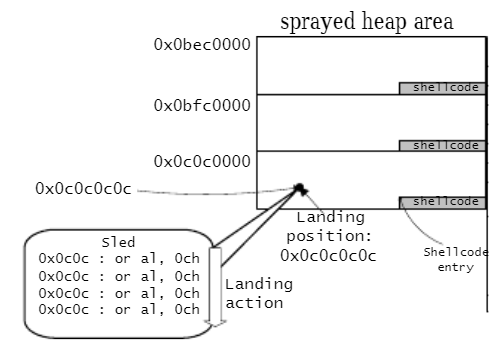

Lệnh `slide` 0x90 (NOP) không được sử dụng ở đây bởi vì các con trỏ virtual function của nhiều đối tượng được lưu trữ trong không gian bộ nhớ. Khi có một virtual function bị ghi đè thành 0x90909090, việc gọi hàm này sẽ làm chương trình bị crash. Hệ điều hành cấp phát cho người dùng một vùng nhớ 2G đầu tiền, nghĩa là từ 0x00000000 - 0x7FFFFFFF, trong đó tiến trình chỉ có thể truy cập vào vùng nhớ 0x00010000 - 0x7FFEFFFF, vùng nhớ 2G cuối (0x80000000 - 0xFFFFFFFF) được thiết kế chỉ để cho kernel truy cập vào. Việc ghi đè địa chỉ 0x0c0c0c0c vẫn thuộc vùng bộ nhớ mà tiến trình của người dùng có thể truy cập vào, ngược lại nếu ghi đè 0x90909090, vùng nhớ này nằm trên vùng nhớ của kernel, tiến trình không được phép truy cập vào sẽ dẫn đến crash.

## 3. Windows XP SP2-Windows 2003
### 3.1 Environmental preparation
32-bit Windows XP SP3 virtual machine, OllyDbg, WinDbg.

### 3.2 Important structure
Ở giai đoạn này, cấu trúc dữ liệu của heap block cơ bản được kế thừa từ cấu trúc dữ liệu của giai đoạn trước (Windows 2000 - Windows XP SP1). Tuy nhiên, các header sẽ được bộ sung các phương thức bảo vệ, vì vậy mà chúng có một số điểm khác so với cấu trúc ban đầu.

Dưới đây là cấu trúc của một heap block ở trạng thái bận:


Dưới đây là cấu trúc của một heap block ở trạng thái nhàn rỗi:

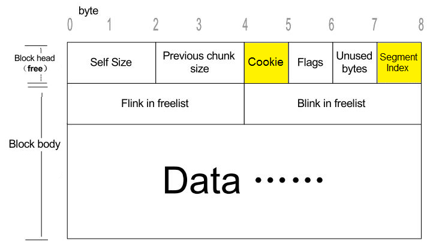

### 3.3 heap block operation
Tại giai đoạn này, Heap allocation được chia thành trình quản lý heap front-end (Front-End Manager) và trình quản lý back-end (Back-End Manager). Trong đó, Front-end Manager chủ yếu thực hiện phân bổ fast table, Back-End Manager gồm các cơ chế phân bổ liên quan đến empty table. Ngoài hai trình quản lý heap trên, các hoạt động như cấp phát, giải phóng và hợp nhất heap block được kế thừa từ hoạt động của heap block trong giai đoạn trước ((Windows 2000 - Windows XP SP1).

### 3.4 Protection mechanism
Từ giai đoạn này, Microsoft đã bắt đầu chú ý đến việc bảo mật trên hệ điều hành Windows, họ đã thêm từ từ các cơ chế bảo mật vào hệ thống như: GS, Safe SEH, DEP, ASLR,... và một số cơ chế bảo vệ heap khác. Trong phần này, tác giả sẽ giải thích các cơ chế bảo vệ heap mới được thêm vào.

#### 3.4.1 Heap Cookie
Heap Cookie được sử dụng từ phiên bản Windows XP SP2, nó thay đổi cơ chế bảo vệ của Windows heap block thành cơ cấu trúc được đề cập ở trên, nó sẽ thay thế 1-byte của segment index trong thông tin của heap header thành cookie được sử dụng để xác minh xem có diễn ra heap overflow hay không, nó cũng thay thế 1-byte tương ứng củng Tag index thành segment index, loại bỏ hoàn toàn tag index.

Cơ chế tạo ngẫu nhiên 1-byte cookie random trong header khi heap block được phân bổ nhằm bảo vệ các vị trí khác trong header: flag, unused bytes, segment index và previous heap block pointer (Flink), dữ liệu của next heap block pointer (Blink) sẽ không thể thay đổi bằng heap overflow. Sau khi heap được giải phóng, nó sẽ kiểm tra xem cookie trong heap header có bị giả mạo hay không, nếu bị giả mạo, hàm RtlpHeapReportCorruption() sẽ được gọi và tiến trình sẽ kết thúc. Điều đáng nói là hàm này chỉ kết thúc tiến trình chỉ sau khi trường HeapEnableTerminateOnCorrupton được thiết lập, tuy nhiên trường này lại không được bật mặc định trong phiên bản của các hệ điều hành trong giai đoạn này dẫn đến việc hàm này không thể đóng tiến trình :).

#### 3.4.2 Safe Unlink
Cơ chế này là một cơ chế được thêm vào dùng để kiểm tra an toàn trước khi thực hiện thuật toán Unlink của giai đoạn trước. Cơ chế này sẽ kiểm tra tính hợp lệ của front pointer và next pointer của heap header khi heap block được xóa khói heap table, nhằm giải quyết vấn đề về việc 2 con trỏ trên có thể bị giả mạo ở phiên bản trước. Dưới đây là một đoạn mã giả được viết bằng code C của cơ chế này:
``` c
// Safe Unlink algorithm
void Safe_Unlink(ListNode *node) {
  if ((node->Blink->Flink == node) && (node->Flink->Blink == node) {
    node->Blink->Flink = node->Flink;
    node->Flink->Blink = node->Blink;
  }
  else {
    ReportHeapCorruption(node);
  }
}
```

#### 3.4.3 PEB Random
Cấu trúc PEB (Process Envirorment Block Structure) chưa thông tin của tiến trình, bằng cơ chế ngẫu nhiên hóa địa chỉ của cấu trúc PEB thay cho địa chỉ cố định (0x7FFDF000) ở phiên bản trước, nó đã giải quyết được mối nguy hại về bảo mật khi thực thi code độc hại thông qua việc thay đổi con trỏ hàm có địa chỉ cố định trong cấu trúc PEB của giai đoạn trước.

### 3.5 Exploit
Như đề cập ở trên, giai đoạn này chỉ thêm vào các cơ chế bảo mật để khắc phục các lỗi xảy ra ở giai đoạn trước, điều này dường như chỉ tập trung khắc phục lỗi ở empty table, do đó các nhà nghiên cứu bảo mật đã tập trung tìm lô hỏng trên fast tables, empty tables No. 0, heap buffers, và empty table bitmaps.

#### 3.5.1 Bypass Safe Unlink
##### 3.5.1.1 Causes of vulnerabilities
Mặc dù việc thêm vào Safe Unlink đã hạn chế các cuộc tấn công sử dụng DWORD SHOOT, các nhà nghiên cứu đã nghiên cứu về cơ chế phát hiện Safe Unlink, một kịch bản rất khắc khe đã được xây dựng để bypass Safe Unlink, họ phát hiện cơ chế này có một lỗ hỏng dẫn đến việc có thể ghi một địa chỉ tùy ý vào.

##### 3.5.1.2 How to use
Theo cơ chế bảo vệ Safe Unlink được đề cập ở trên, khi unlinking một heap block, nó sẽ kiểm tra liệu trường Flink của heap block tiếp theo nó và trường Blink của heap block phía trước nó có trỏ đến nó hay không. Hai con trỏ này cách nhau 4 byte, vì vậy ta có thể hiểu đoạn code kiểm tra điều kiện ở trên có thể thay bằng đoạn code sau:
``` c
if ((node->Blink == node) && (node->Flink + 4 == node))
```

Khi heap block cần được hủy liên kết là heap block duy nhất trên empty table, sẽ có một trường hợp đặt biệt diễn ra: trường Flink và Blink của heap block đó giống nhau đều trỏ đến empty header node và trường Flink và Blink của empty header node cũng bằng nhau và trỏ đến heap block đó, xem hình bên dưới sẽ rõ hơn:

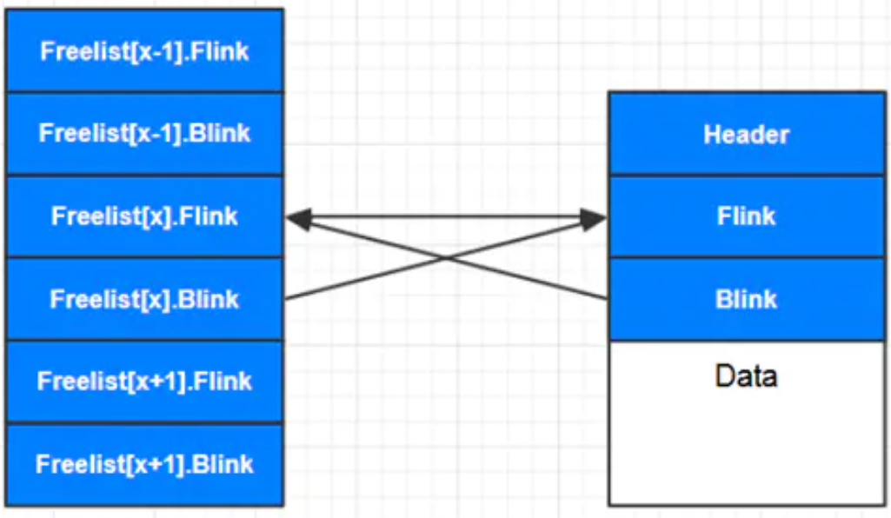

Nếu có thể sửa đổi trường Flink của heap block đó đến Freelist[x-1].Blink thông qua lỗ hỏng heap overflow và sửa đổi trường Blink thành Freelist[x].Blink, ta vẫn sẽ bypass được Safe Unlink, xem hình dưới để có cái nhìn rõ hơn:

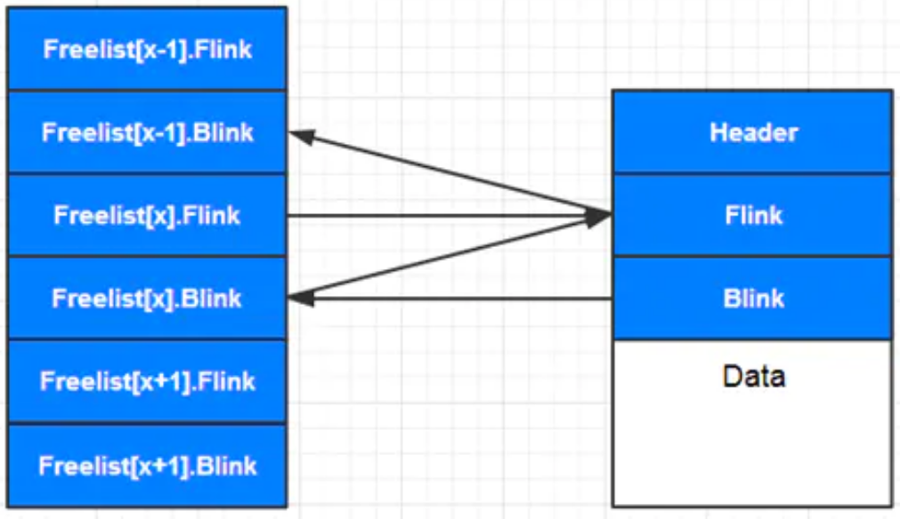

Sau khi bypass được Safe Unlink, hệ thống sẽ thực hiện Unlink bình thường và kết quả sẽ như hình sau:

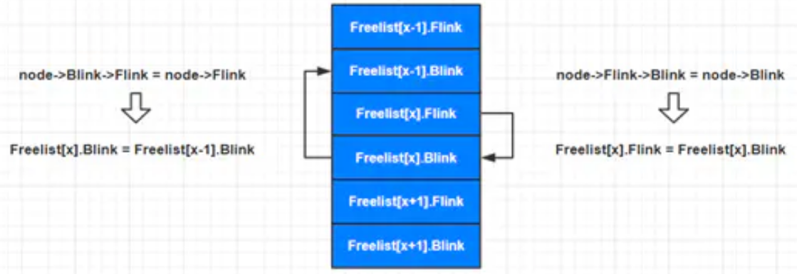

Nếu ta tạo ra một heap block có kích thước tương đương với Freelist[x], Heap block được trỏ bởi Freelist[x] sẽ được cấp phát theo thuật toán được xây dựng trước đó. Như vậy Freelist[x-1].Blink và vùng nhớ bên dưới nó sẽ được cấp phát và xem như là một heap block, vùng dữ liệu mà người dùng nhập vào sẽ từ Freelist[x], do đó ta có thể ghi đè Freelist[x].Blink thành bất kỳ địa chỉ nào mà ta muốn, từ đó ta tiếp tục ghi đè dữ liệu vào địa chỉ ta đã tạo.

#### 3.5.2 LookAside Attack
##### 3.5.2.1 Causes of Vulnerability
Lỗ hỏng này được tạo ra khi fast table phân bổ một heap block, tính hợp pháp của địa chỉ được trỏ bởi trường Flink không được kiểm tra, điều này khiến cho người dùng có thể gán một địa chỉ giả mạo vào heap header khi fast table thực hiện thuật toán phân bổ bộ nhớ, tùy đó dẫn đến lỗ hỏng ghi dữ liệu bất kỳ vào địa chỉ bất kỳ.

##### 3.5.2.2 How to use
Dựa vào heap overflow, do fast table chỉ sử dụng danh sách liên kết đổi (chỉ dùng Flink), nên ta sử dụng heap overflow để sửa đổi previous pointer của heap block được liên kết với empty table để nhảy đến địa chỉ hàm hoặc địa chỉ của virtual table, sau đó xây dụng một heap block giả tại địa chỉ ấy. Khi fast table phân bổ một heap block ở lần đầu tiên có kích thước tương ứng, heap header được làm giả sẽ được phân bổ cho người dùng sử dụng, và địa chỉ Flink không hơp lệ sẽ được liên kết với một empty header node như là một heap header. Khi fast table phân bổ một heap block ở lần thứ hai có kích thước tương ứng, địa chỉ đặc biệt và vùng nhớ đằng sau nó sẽ được xem là một heap block cấp phát cho user, từ đó user có thể ghi đè bất kỳ dữ liệu nào vào địa chỉ này. Các địa chỉ đặc biệt này có thể là địa chỉ của các hàm hay địa chỉ của virtual table cũng như các địa chỉ bị ảnh hưởng trong các cuộc tấn công heap được đề cập ở trên như cấu trúc PEB và các cấu trúc xử lý ngoại lệ khác nhau. Xem hình bên dưới để hiểu rõ hơn về cách hoạt động: 

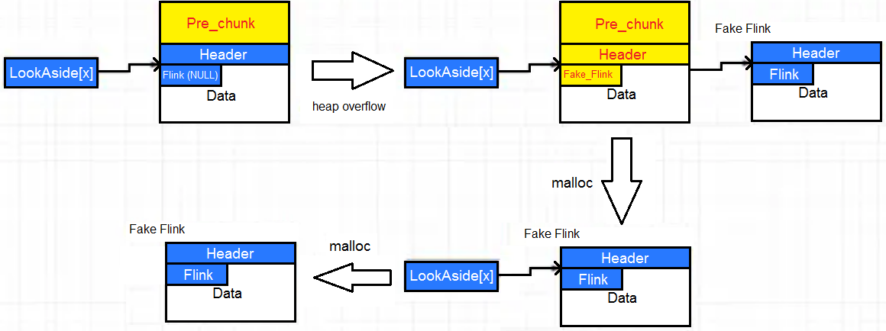

#### 3.5.3 Bitmap XOR Attack
##### 3.5.3.1 Causes of vulnerabilities
Lỗ hổng này xảy ra khi trạng thái của empty table bitmap được cập nhật, nó sử dụng trường Size của heap block để làm index mà không kiểm tra tính hợp lệ, điều này khiến trạng thái của empty table bitmap khác với trạng thái của empty table. Cuối cùng nó cũng sẽ gây lỗ hỏng khiến người dùng có thể ghi dữ liệu tùy ý vào địa chỉ bất kỳ. Dưới đây là mã giả của thuật toán cập nhật empty table bitmap:
``` c
// Safe Unlink
next = vent->Flink;
prev = vent->Blink;
if ((prev->Flink != next->Blink) || (prev->Flink != listhead)) {
  RtlpHeapReportCorruption(vent);
}
else {
  prev->Flink = next;
  next->Blink = prev;
}

// Update Bitmap
if (next == prev) {
  vSize = vent->Size;
  vHeap->FreeListsInUseBitmap[vSize >> 3] ^= 1 << (vSize & 7);
}
```

##### 3.5.3.2 Usage
Như thuật toán được biểu diên bằng mã giả ở trên, sau khi mỗi heap block trong bảng empty table được hủy liên kêt, nó sẽ xem xét xem empty table bitmap tương ứng có cần được cập nhật lại. Nếu heap block bị hủy liên kết là heap block cuối cùng trong bảng empty table, empty table bitmap tương ứng với trường size sẽ được xor. Dựa trên kịch bản heap overflow sẽ thấy được nhiều lỗ hỏng trong thuật toán này.

Đầu tiền tạo một empty table chỉ có một heap block và có xảy ra heap overflow heap liền kề trước nó như hình bên dưới:

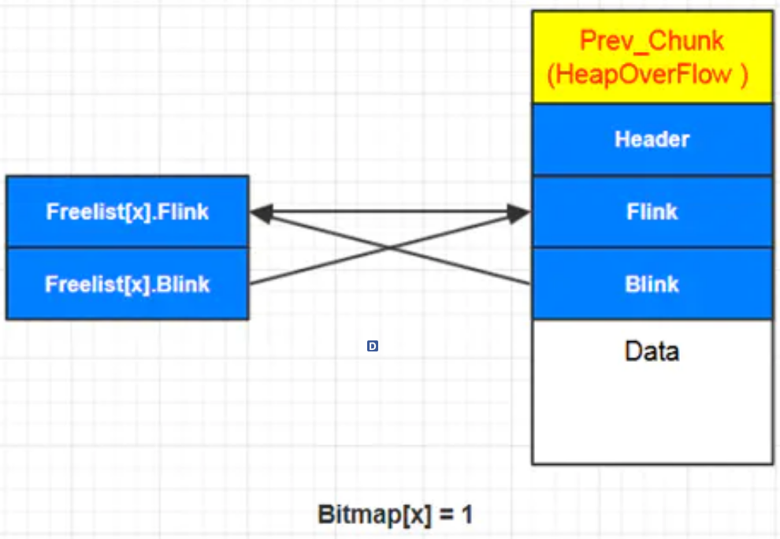

nếu có thể overflow single-byte phía trên heapblock, nó có thể ghi vào trường size của heap block trong empty table. Trước khi thực hiện hoạt động Unlink heap block trong empty table, đầu tiên nó sẽ thay đổi trường size thành n*8 như hình bên dưới:

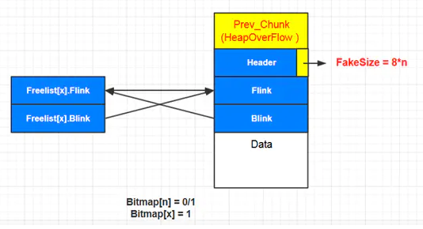

Theo thuật toán cập nhật của empty table bitmap. heap block sẽ thực hiện hoạt động hủy liên kết như bình thường, sau đó đoạn code để cập nhật empty table bitmap sẽ được thực thi. Tuy nhiên, trường size lúc này đã bị ghi đè, nó không thay đổi index theo bitmap[x] mà theo bitmap[n], từ đó xor index đó trong empty table bitmap dẫn đến bitmap[x] không thay đổi, còn bitmap[n] thì bị đảo ngược lại (từ 0 thành 1 hoặc từ 1 thành 0). 

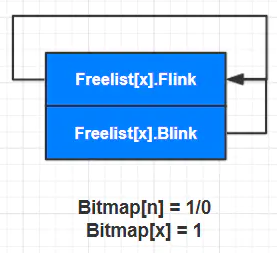

Tại thời điểm này, không có bất kỳ heap block nào trong empty table x, previous pointer và next pointer của header sẽ trỏ đến chính nó (hình trên). Và empty table bitmap tương ứng với nó (bitmap[x]) sẽ có giá trị là 1, lúc này, khi nhìn bào empty table bitmap, trình quản lý heap sẽ nghĩ rằng vẫn có một free heap block nằm ở empty table x. Nếu user đăng ký một vùng nhớ có kích thước là 8 * x, trình quản lý sẽ xem vùng nhớ từ freelist[x].Flink trở xuống là một heap block và sẽ cấp phát cho người dùng, từ đó, người dùng có thể ghi dữ liệu bất kỳ vào địa chỉ bất kỳ.

Kịch bản được bàn luận ở trên xảy ra khi heap overflow chỉ đè vào bit size của header. Khi heap overflow có thể ghi đè trường con trỏ của item trước và sau heap block, ta có thể mở rộng kịch bản này bằng nhiều kỹ thuật tấn công khác.

Kịch bản đầu tiên là ghi đè previous pointer và the next pointer thành cùng một giá trị. Tại thời điểm này, theo thuật toán update của empty table bitmap,  cơ chế phát hiện an toàn của Safe Unlink sẽ kiểm tra và hoạt động hủy liên kết sẽ không được thực hiện trên heap block đó. Hàm RtlpHeapReportCorruption() được gọi, như đề cập ở trên, hàm này sẽ không dừng tiến trình trong phiên bản này. Do đó 2 con trỏ prev và next không thay đổi sau khi được kiểm tra. Lúc này hệ thống sẽ tiến hành cập nhật empty table bit map, trường size lúc này đã được thay đổi bằng heap overflow, các bước tiếp theo sẽ được thực hiện như trên.

Kịch bản thứ hai được xây dựng để việc hủy liên kết được bỏ qua thông qua việc gán con trỏ prev và next luôn bằng nhau. và empty table bitmap phải được cập nhật. Do đó nó không cần heap block bị overflow phải là heap block nằm trong empty list, điều này giúp cho việc ứng dụng kịch bản trên trở nên mở rộng và đa dạng hơn.

#### 3.5.4 Freelist[0] Linking Attack
##### 3.5.4.1 Causes of vulnerabilities
Sau khi giới thiệu cơ chế Saft Unlink làm cho việc hủy liên kết trở nên khó khăn hơn, các nhà nghiên cứu chuyển sự chú ý sang tiến trình liên kết ngược của việc hủy liên kết. Họ đã sớm phát hiện rằng hoạt động liên kết đã không có các cơ chế bảo vệ giúp phát hiện tính hợp lệ của prev pointer và next pointer của heap block và có thể làm tương tự như lỗ hỏng DWORD SHOOT thông qua việc gán con trỏ. Tuy nhiên, họ thấy rằng nó có một hạn chế so với DWORD SHOOT, nó chỉ có thể ghi 4 byte địa chỉ heap block thành một địa chỉ bất kỳ. Dưới đây là đoạn mã giả của thuật toán liên kết, trong đó chunk A là một heap block sẽ được liên kết với empty table NO. 0, chunk B là một heap block nằm trong empty table NO. 0.
``` c
// Link algorithm
ChunkA->Flink = ChunkB->Flink;
ChunkA->Blink = ChunkB->Blink;
ChunkB->Blink->Flink = ChunkA;
ChunkB->Flink->Blink = ChunkA;
```

##### 3.5.4.2 Usage
Đầu tiên xây dựng một kịch bảng ghi đè ít nhát 0x10 bytes vào prev block của block liền kề trong freelist[0], kích thước của block phía sau nó nên lớn hơn 2 lần kích thước của nó, ở đây là 0x220 * 2 < 0x550 byte như hình bên dưới:

![Freelist[0] Linking Attack(1)](pic/pic15.PNG)

Trước khi đăng ký một heap block từ empty list 0, ta sẽ overflow heap header của heap block đó trong empty list, ghi đè 2 con trỏ prev và next, không cần thay đổi trường size như hình sau:

![Freelist[0] Linking Attack(2)](pic/pic16.PNG)

Lúc này, ta đăng ký một heap block có kích thước nằm ở giữa kích thước của 2 heap block đó trong empty list, như ở đây ta sẽ đăng ký kích thước là 0x250 vì 0x220 < 0x250 < 0x550 và 0x550 - 0x250 > 0x250. Theo thuật toán phân bổ heap của NO. 0 empty table, heap block có kích thước 0x550 sẽ được hủy liên kết đầu tiên. Con trỏ prev và next của block này đã bị thay đổi, do đó nó sẽ không pass cơ chế kiểm tra Safe Unlink, việc hủy liên kết sẽ không được thực hiện và heap block đó sẽ được chia thành 2 heap block 0x250 và 0x300, heap block 0x250 sẽ được cấp phát cho người dùng, còn heap block 0x300 sẽ được chèn vào vị trí thích hợp trong empty table NO. 0 theo thuật toán, và chắc chắn nó sẽ nằm sau heap block 0x250 (0x250 < 0x300 < 0x550):

![Freelist[0] Linking Attack(3)](pic/pic17.PNG)

Trước khi thực hiện việc Link heap block này tại một vị trí thích hợp, nó sẽ xét trường size của Flink_Fake và Blink_Fake (hiểu đơn giản là xét kích thước 2 heap block trước và sau nó) có lớn hơn heap block cần được chèn vào hay không, trong kịch bản này [Fake_Flink-8]>0x300 và [Fake_Blink-0xc]0x300. Ngoài ra các điều kiện cần được thỏa mãn và địa chỉ của Fake_Flink và Fake_Blink+4 có thể được ghi.

Sau khi thỏa mãn các điều kiện ở trên, heap block 0x300 sẽ được chèn vào vị trí thích hợp trong NO. 0 empty table, lỗ hỏng thuật toán Link sẽ được được biểu diễn như sau:
``` c
// Trigger effect
0x300Chunk->Flink = Fake_Flink;
0x300Chunk->Blink = Fake_Blink;
[Fake_Flink] = 0x300Chunk;
[Fake_Blink + 4] = 0x300Chunk;
```

Vì trường Fake_Flink và Fake_Blink có thể kiểm soát được thông qua heap overflow, ta có thể ghi đè địa chỉ của heap  block thành địa chỉ bất kỳ. Mặc dù nó khá là khó để chiếm được quyền điều khiển, ta vẫn có thể phối hợp cùng các lỗ hỏng khác để thực hiện exploit.

#### 3.5.5 Freelist[0] Searching Attack
##### 3.5.5.1 Causes of vulnerabilities
Lỗ hỏng tạo ra khi duyệt NO. 0 empty table để tìm ra một heap block thích hợp, tính hợp lệ của con trỏ của heap block trong danh sách liên kết không được xác thực khiến NO. 0 empty table jump out khi đang duyệt, gây ra lỗ hổng khiến ta có thể ghi đè bất kỳ vào địa chỉ bất kỳ.

##### 3.5.5.2 Usage
Đầu tiên xây dựng kịch bản sao cho ghi đè được ít nhất 0xc bytes vào prev pointer của heap block liền kề với trong Freelist[0], lưu ý heap block này không phải là heap block có kích thước lớn nhất trong NO. 0 empty table.

![Freelist[0] Searching Attack(1)](pic/pic18.PNG)

Trước khi bắt đầu, ta sẽ tiền hành sử dụng heap overflow để ghi đè vào prev pointer, trong kịch bản này, ta không cần phải ghi đè trường size.

![Freelist[0] Searching Attack(2)](pic/pic19.PNG)

Lúc này, tiến hành đăng ký một vùng nhớ có kích thước lớn hơn kích thước heap block bị overflow và nhỏ hơn kích thước của heap block lớn nhất trong NO. 0 empty table. Theo thuật toàn tìm kiếm của NO. 0 empty table, khi đang duyệt heap block bị overflow, Fake_Link giả sẽ được sử dụng như một địa chỉ chứa heap block tiếp theo, và trường size sẽ được so sánh xem có đáp ứng được vùng nhớ chương trình yêu cầu không, 

![Freelist[0] Searching Attack(3)](pic/pic20.PNG)

Để trình quản lý heap xem địa chỉ Fake_Flink như một heap block để cấp phát cho user, nó cần thỏa mãn rằng trường size của [Fake_Flink-8] phải lớn hơn kích thước chương trình yêu cầu. Để không xảy ra việc phân một heap block thành hai heap block nhỏ, trường size nên được kiểm soát nhỏ hơn kích thước chương trình yêu cầu + 8 byte (RequestSize < SizeField < RequestSize + 8). Sau khi thỏa điều kiện, heap block giả sẽ được Unlink. Tuy nhiên nó sẽ bị phát hiện bởi cơ chế Safe Unlink, để nó vẫn sẽ được cấp phát cho người dùng, ta cần giả mạo Fake_Flink và Fake_Flink + 4 (Flink và Bilnk) thành một vùng hợp lệ thỏa Safe Unlink.

## 4. Windows Vista-Windows 7
### 4.1 Environmental preparation
32-bit Windows 7 SP1 virtual machine, OllyDbg, WinDbg.

### 4.2 Important structure
Bắt đầu từ Windows Vista, hệ điều hành Windows đã loại bỏ trình quản lý front-end và fast table vốn là phần cốt lõi của phiên bản trước. Các tập hợp cấu trúc dữ liệu và thuật toán mới được gọi là Low Fragmentation Heap được giới thiệu như front-end heap. Và để thích ứng với trình quản lý heap front-end mới, cơ chế quản lý của trình quản lý heap back-end cũng khác với trình quản lý heap back-end của phiên bản trước.

Bắt đầu từ phiên bản này, cấu trúc của heap block được cấp phát cho người dùng bởi trình quản lý heap front-end đã được đổi thành UserBlocks, cái mà tương tự như Lookaside của phiên bản trước. Cấu trúc của heap block được cấp phát đến người dùng bởi trình quản lí heap back-end được thay đổi thành ListHints, cái mà tương tự như Freelist ở phiên bản trước. Ngoài ra, còn có một Freelists members trong HeapBase quản lý heap, khiến ta có thể nhầm lẫn với Freelist trong phiên bản trước. nó (Freelist**s**) là một danh sách các con trỏ liên kết đến tất cả các free heap được quản lý bởi HeapBase, điều đáng nói là một block của nó sẽ có đơn vị khác: 1 block = 8 byte.

#### 4.2.1 UserBlocks


